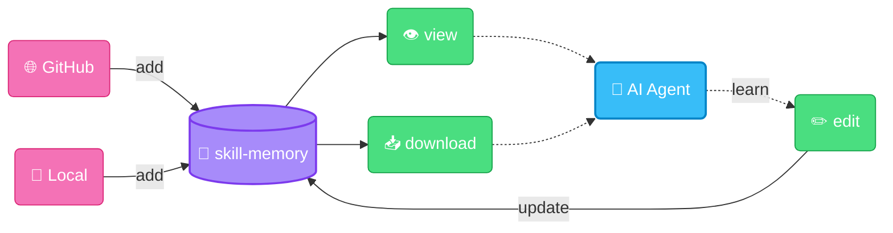

<div align="center">
  <h1>skill-memory</h1>
  <p>
    one skill to rule them all.
  </p>
  <p>
    <a href="https://github.com/memodb-io/skill-memory/actions/workflows/ci.yml"></a>
  </p>
</div>


`skill-memory` is a store for your agent skills, using `git`:

- It can download public skills, and maintain forked versions of them.
- You can edit, reuse and share many skills by importing only one `skill-memory` skill.
- Use it as an agent memory consisting of skills, versioning controlled by `git`




## Installation

Add `skill-memory` skill to your agent:

```bash
npx skills add memodb-io/skill-memory
```

and type `setup skill-memory` in your agent.


## Quick Start

In your agent, enter those:

- `add skills in vercel-labs/agent-skills to memory`
- `tell me about web design skill in your memory`
- `update web design skill in memory that I only want blue theme`
- `summarize your learnings and update the skills in memory`
- `create a skill in memory about my taste on software development: always write a dev plan first`

View your skill-memory commits:

```bash
skill-memory history
```


## Configuration

### Envs

| Variable            | Description                                         | Default           |
| ------------------- | --------------------------------------------------- | ----------------- |
| `SKILL_MEMORY_HOME` | Custom storage location for skills and cached repos | `~/.skill-memory` |
